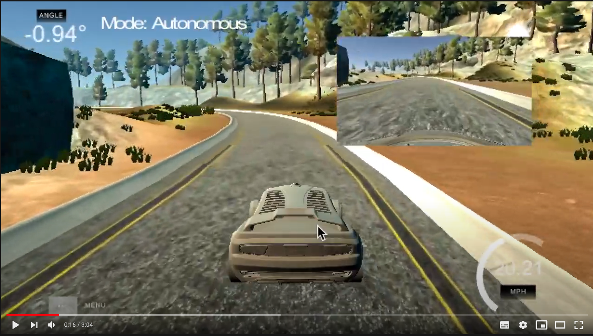

# **Behavioral Cloning** 

[](http://www.udacity.com/drive)


## Writeup

---

**Behavioral Cloning Project**

[](https://youtu.be/14mb9vo7EgQ)

The goals / steps of this project are the following:
* Use the simulator to collect data of good driving behavior
* Build, a convolution neural network in Keras that predicts steering angles from images
* Train and validate the model with a training and validation set
* Test that the model successfully drives around track one without leaving the road
* Summarize the results with a written report


[//]: # (Image References)
[arch]: ./writeup_images/arch.png "arch"
[model_1_loss]: ./writeup_images/model_1_loss.png "model_1_loss"
[distribution_skewed]: ./writeup_images/distribution_skewed.png "distribution_skewed"
[distribution_normal]: ./writeup_images/distribution_normal.png "distribution_normal"
[right_recover]: ./writeup_images/right_recover.gif "right_recover"
[center_driving]: ./writeup_images/center_driving.gif "center_driving"
[left_recover]: ./writeup_images/left_recover.gif "left_recover"
[flipped]: ./writeup_images/flipped.png "flipped"

---
### Files Submitted & Code Quality

#### 1. Project files to run the simulator in autonomous mode

* model.py containing the script to create and train the model
* drive.py for driving the car in autonomous mode
* model.h5 containing a trained convolution neural network 
* readme.md summarizing the results

#### 2. Simulation

Using the Udacity provided simulator and my drive.py file, the car can be driven autonomously around the track by executing 
```sh
python drive.py model.h5
```

#### 3. Training

For the model training I had used free Google Colab GPU notebook. The Tensorflow and Keras version used were 1.15.2 and 2.31 
respectively. 

To follow this technique, `colab_training.ipynb` provides the examples. The final cell shows the command used to execute the training job.

```sh
python model.py training --batch=128 --es-patience=1 --epoch=10 --artifact-dst=model.h5

```

Note: The `model.py` file must be uploaded through **upload to session storage** first before executing the above command.

* training is the directory of driving_log and images.
* es-patience is the Early Stopping parameter for the number of time to wait before stop the training. 
* artifact-dst is the full path to save the model. This can be used to save into mounted folder in case of the notebook
terminated unexpectedly during training.


### Model Architecture and Training Strategy

#### 1. Model Architecture

My model consisted of 6 convolutionals layers and 3 fully connected layers. The architecture was adapted from the [Nvidia Research](http://images.nvidia.com/content/tegra/automotive/images/2016/solutions/pdf/end-to-end-dl-using-px.pdf).

In the first and second layers, images are normalized and cropped at the top and bottom to remove noises unrelated to driving.
After that, followed by 3 convolutional layers with kernel size 5x5 and strides 2x2 and another 3 with kernel size 3x3 and strides 1x1.
I used ELU instead of RELU for non-linear activation functions as from this [ELU as an activation function](https://deeplearninguniversity.com/elu-as-an-activation-function-in-neural-networks/)

#### 2. Reduce overfitting

To reduce overfitting I used dropout with probability of 20%.
The Early stopping is also used to stop the training automatically after the performance of the validation dataset
hasn't improved after a preset number. This can be configured through `--es-patience` parameter.

#### 3. Model parameter tuning

The model used an adam optimizer after several try and errors I found the the default parameter for learning rate was better.

#### 4. training data

Training data was chosen to keep the vehicle driving on the road. I used a combination of center lane driving, recovering from the left and right sides of the road.

For details about how I created the training data, see the next section. 

### Model Architecture and Training Strategy

#### 1. Solution Design Approach

My first step was to use a convolution neural network model similar to the [comma.ai](https://github.com/commaai/research/blob/master/train_steering_model.py).
The codes for the keras is used to bootstrap my experiments. 

However the model above was not able drive pass the sharp curve part of the road. 

The following diagram shows the diagnostic of the model

![alt text][model_1_loss]

I was puzzled, everything looks correct at least from the loss chart. I had hypothesized either the data was not captured right
or the model may require more convolutional layers to identify curvature.

I decided to give a try for Nvidia architecture introduced during the lesson as it consisted more convolutional layers.
The modification from the Nvidia only the 6th convolutional layers as the model performed better by adding this from
my experimentation.

This architecture performance was better, fewer spots where the vehicle fell off the track. I suspected the training data was
probably the reason as I only use keyboard for control.

![alt text][distribution_skewed]


From the dataset distribution of steering angle, I can see the angle 0 overly skewed the data. 
This may have effect to the performance of the model. I used data resampling to achieve near normal distribution.


![alt text][distribution_normal]

The vehicle finally able to drive the track without leaving the road but the driving was a bit jitter.

At the end I implemented the data augmentation to use left and right with angle correction and dropped the resampling,
the car is able to drive more smoothly and able to pass the second track until to the point of super sharp corner.

#### 2. Final Model Architecture

The final model architecture is the one adapted from Nvidia.

| Layer         | Description                               |
|---------------|-------------------------------------------|
| Input         | RGB Image 160x320x3                       |
| Normalization | Data normalization                        |
| Cropping      | Output 80x320x3                           |
| Convolutional | Kernel 5x5, Strides 2x2, Output 38x158x24 |
| ELU           | Activation function                       |
| Convolutional | Kernel 5x5, Strides 2x2, Output 17x77x36  |
| ELU           | Activation function                       |
| Convolutional | Kernel 5x5, Strides 2x2, Output 7x37x48   |
| ELU           | Activation function                       |
| Convolutional | Kernel 3x3, Strides 1x1, Output 5x35x64   |
| ELU           | Activation function                       |
| Convolutional | Kernel 3x3, Strides 1x1, Output 3x33x64   |
| ELU           | Activation function                       |
| Convolutional | Kernel 3x3, Strides 1x1, Output 1x31x64   |
| ELU           | Activation function                       |
| Flatten       | Output 1x1984                             |
| Dense         | Output 1x100                              |
| ELU           | Activation function                       |
| Dense         | Output 1x50                               |
| ELU           | Activation function                       |
| Dense         | Output 1x10                               |
| ELU           | Activation function                       |
| Dense         | Output 1x1                                |

Here is a visualization of the architecture.

![alt text][arch]

#### 3. Creation of the Training Set & Training Process

To capture good driving behavior, I first recorded several laps on track one using center lane driving. Here is an example image of center lane driving:

![alt text][center_driving]

I then recorded the vehicle recovering from the left side and right sides of the road back to center 
so that the vehicle would learn to recover back to center.
These images show what a recovery looks:

![alt text][left_recover]
![alt text][right_recover]


To augment the dataset, I flipped the left, right and center images and negate its angle. The following image show
how the flipped looks like.

![alt text][flipped]

After the collection process, I had 26,709 driving log records. Each of the records consisted of 3 images
and then each were flipped. Overall the total data generated is 160,254.

These data were then randomly splitted into 20% for validation set and 80% for training.

I used this training data for training the model. The validation set helped determine if the model was over or under fitting.
